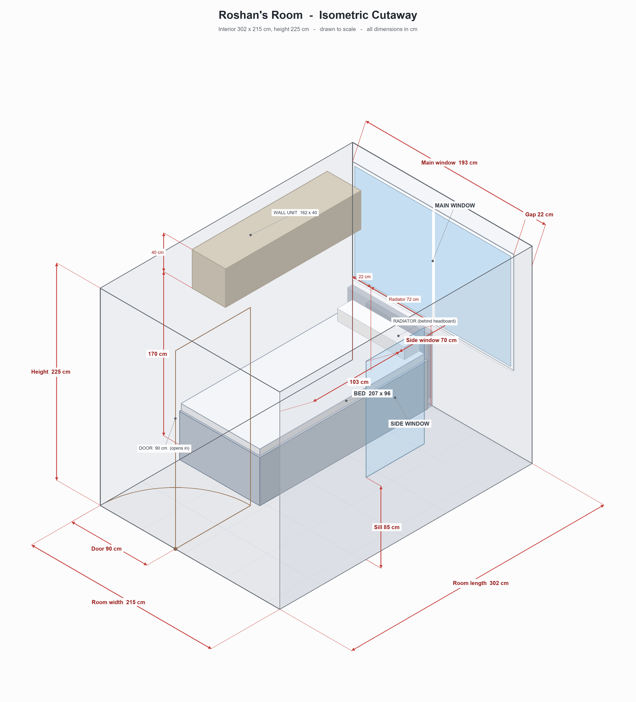

# Roshan's Room — Interactive Plan

A to-scale, interactive 3D floor plan of Roshan's room, built with [three.js](https://threejs.org/) in a single self-contained `index.html` (no build step).

**▶ Live:** https://khairm.github.io/roshans-room/

## Controls
- **Drag** to orbit · **scroll** to zoom · **right-drag** to pan
- **Drag the door handle** to open/close the door to any angle
- **Click the bed** to roll the underbed out · **click the underbed** to stow it
- Toolbar: view presets, wall modes (Auto / Glass / Off), dimensions, labels, underbed

## Room
Interior **302 × 215 cm**, height **225 cm**. Everything is drawn to scale:

- IKEA **SLÄKT** bed (206 × 98) with pull-out underbed — extends to 193 cm wide
- Wall-mounted unit (162 × 40, mounted 170–210 cm)
- Main window + radiator (back wall), side window (right wall)
- Door (90 cm) on the front wall

*Static isometric export generated by `tmp/draw_room.py` (not deployed).*
